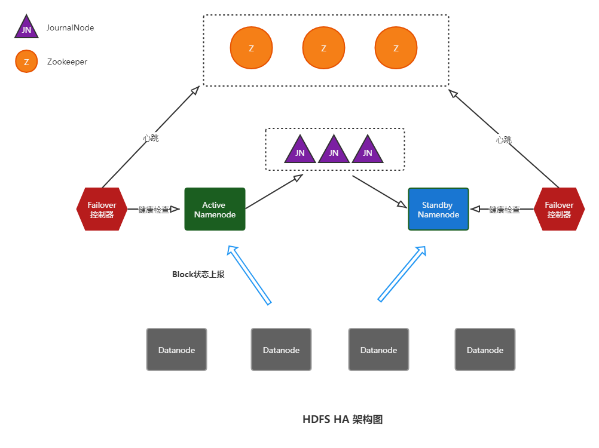

## 高扩展

HDFS Federation可以解决单一命名空间的问题，突破单namenode节点的内存限制。多个HDFS集群组合成一个联盟，每个HDFS集群负责根目录下的一个子目录。

例如集群A负责`/share`目录，集群B负责`/share2`目录。

通常情况下，Federation模式会和HA模式组合使用，其部署模型如下所示：

## 高可用

HDFS Highly Available

- Active Namenode

HDFS Namenode主节点

- Standby Namenode

HDFS Namenode从节点，通过Journal Node集群同步主节点的状态信息，以提供快速的故障转移。

- Failover控制器

监控主namenode节点的操作系统，进程等健康状态，定时向Zookeeper集群发送心跳信息。当主节点发生异常，Failover控制器会暂停心跳，zookeeper watch机制会通知从节点的Failover控制器将从节点调整为主节点。

## todo-list

1. 共享hadoop集群

yarn队列规划配置，几种常见的调度器

2. hadoop安全

配置keberos协议