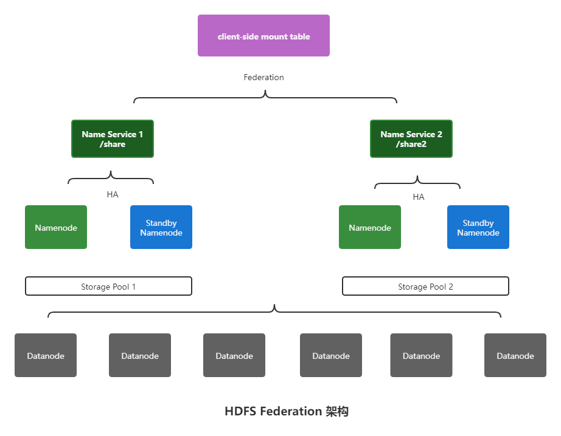

## namenode的文件分类

- fsimage
- edits
- seen_txid
- VERSION


### fsimage

fsimage文件是文件系统快照，可以使用`hdfs oiv`命令查看。


### edits

启动时会合并fsimage和edits文件的内容。edits文件是实时增加的操作日志，而fsimage时定时生成的。edits文件可以使用`hdfs oev`查看。


### seen_txid

edits文件的尾数,启动时会按照顺序加载edits文件，直至尾数指示的edits文件。

## 安全模式

HDFS启动时，会检测文件系统的完整性，此时不允许写操作，会处于所谓的“安全模式”（safe mode）。


查看安全模式状态：

```bash
hdfs dfsadmin -safemode get
```

强制退出安全模式：

```bash
hdfs dfsadmin -safemode leave
```

## 高扩展

HDFS Federation可以解决单一命名空间的问题，突破单namenode节点的内存限制。多个HDFS集群组合成一个联盟，每个HDFS集群负责根目录下的一个子目录。

例如集群A负责`/share`目录，集群B负责`/share2`目录。

通常情况下，Federation模式会和HA模式组合使用，其部署模型如下所示：




## 高可用

HDFS Highly Available


- Active Namenode

HDFS Namenode主节点

- Standby Namenode

HDFS Namenode从节点，通过Journal Node集群同步主节点的状态信息，以提供快速的故障转移。

- Failover控制器

监控主namenode节点的操作系统，进程等健康状态，定时向Zookeeper集群发送心跳信息。当主节点发生异常，Failover控制器会暂停心跳，zookeeper watch机制会通知从节点的Failover控制器将从节点调整为主节点。