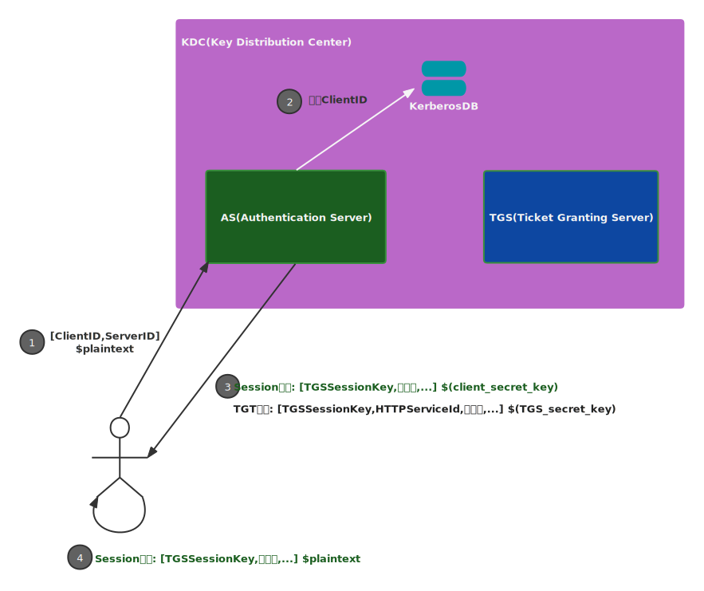
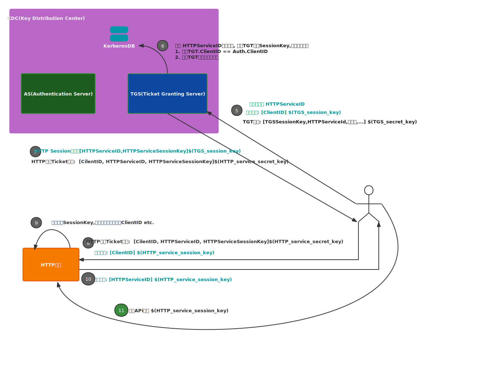

# kerberos 协议

## Kerberos是做什么的？

一种**不用网络传输密码**的**认证**协议。

> Kerberos是希腊神话中地狱之神哈迪斯(Hades)的三头守护犬的名字。这很贴合KDC(key distribution center),请求客户端，请求服务端三方在认证场景下的角色。英魂之刃里面哈迪斯的大招抓人很强的。哈哈哈

## Kerberos Realm

域(Realm)是包含所有请求客户端,KDC,请求服务端主机。

## Kerberos认证特点

客户端要访问服务端，需要完成三步交互：

1. 访问AS(Authentication Server)
2. 访问TGS(Ticket Granting Server)
3. 访问服务端

kerberos认证有如下特点：

- 每次交互都会获得两条信息，一个信息可以解密，一个信息不可解密
- 服务端不会直接访问KDC
- KDC存储所有密钥(secret keys)
- 密码不会经过网络传输

## 认证过程

KDC由AS,TGS,KerberosDB 三部分组成

### Step 1: 初始化请求

客户端向AS发送以下信息:

- ClientID
- HTTP Service ID
- 客户端的网络地址（可为空，表示任何机器可用）
- 预期TGT有效时间

### Step 2: 验证客户端

AS请求kerberosDB验证ClientID是否存在，如果存在则随机生成一个TGSSessionKey。

AS向客户端发送两条消息，一条可解密，一条不可解密。

### Step 3: 获取TGT
#### TGS Session消息 （可解密）

使用客户端的私钥进行加密，包含：

- TGS ID
- timestamp
- 有效时间
- TGS Session Key

客户端可以使用自己私钥解密出TGS Session Key，用于后续与TGS通信获取服务Ticket

#### TGT消息 （不可解密）

使用KDC TGS的私钥加密，包含：

- ClientID
- TGS ID
- timestamp
- TGT lifetime
- Client客户端地址
- **TGS Session Key**

### Step 4: 解密TGS Session Key

客户端使用自己的私钥从*TGS Session消息*解密出TGS Session Key

### Step 5: 向TGS请求服务Ticket

客户端会发送三条消息：服务消息，认证消息(Authenticator), TGT消息

#### 服务消息

明文消息，包含

- HTTP Service ID
- 请求的Ticket预期有效时间 

#### 认证消息

使用第4步获取到的TGS Session Key加密，包含

- ClientID
- timestamp

#### TGT消息

为第4步客户端获取到的TGT

### Step 6: TGS校验

收到服务消息，校验服务是否存在

TGS收到TGT消息，使用自己的私钥解密,获取其中的`TGS Session Key`.

TGS收到认证消息，使用`TGS Session Key`解密。

所有消息解密之后，TGS进行如下校验：

- 对比认证消息和TGT消息中的ClientID是否相等
- 对比认证消息和TGT消息中的timestamp，差距不超过2min
- 检验TGT是否过期，且在TGS缓存中

校验完成，随机生成一个HTTP Session Key,用于后续客户端和服务端之间的加密通信。
### Step 7: TGS发送客户端Ticket

TGS会向客户端发送HTTP服务Ticket消息和HTTP Session消息。

#### HTTP服务的Ticket消息

HTTP服务Ticket消息,使用HTTP服务的私钥进行加密，客户端不可解。包含

- ClientID
- HTTP Service ID
- 网络地址
- timestamp
- ticket的过期时间
- **HTTP服务SessionKey**

#### HTTP Session消息

HTTP Session消息使用第4步获取的TGS Key进行加密。客户端可解密，包含：

- HTTP Service ID
- timestamp
- ticket的过期时间
- **HTTP服务Session Key**

### Step 8: 客户端使用Ticket访问HTTP服务

客户端向HTTP服务发送两条消息: 第7步获取到的Ticket消息和认证消息

认证消息还是包括ClientID和timestamp,使用HTTP服务的Session Key进行加密。

### Step 9: 校验Ticket

HTTP服务使用自己的私钥解析出HTTP服务的Session Key，使用HTTP服务Session Key解密认证消息。然后校验如下：

- 认证消息的ClientID与HTTP服务Ticket消息的ClientID相等。
- 校验认证消息的timestamp和HTTP服务Ticket消息的timestamp相差不超过2min
- 检查ticket是否过期

### Step 10: 校验HTTP服务

HTTP服务使用HTTP服务Session key对HTTP服务认证消息进行加密。

HTTP服务认证消息包含HTTP Service ID和时间戳。

### Step 11: 认证通过

后续请求使用缓存的HTTP Service Ticket访问HTTP服务。只要Ticket没有过期。

HTTP服务需要支持kerberos协议. 浏览器支持[SPNEGO/Negotiate](https://www.ietf.org/rfc/rfc4559.txt).
## Reference List

1. [Explain like I’m 5: Kerberos](https://www.roguelynn.com/words/explain-like-im-5-kerberos/)