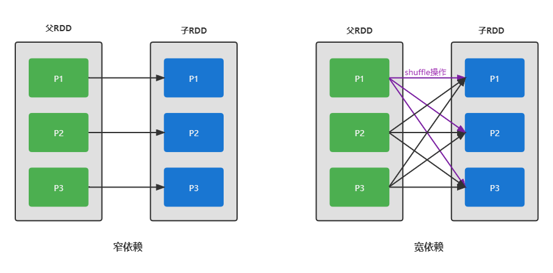

## spark RDD

spark RDD(resilent distributed dataset) 弹性分布式数据集。

一个RDD会被划分成多个分区(Partition)

### spark 程序性能优化

`shuffle`操作决定了spark程序性能的高低。

#### 宽依赖和窄依赖

窄依赖（narrow dependency）指的是父RDD分区和子RDD分区一一对应。

宽依赖（wide dependency）指的是父RDD分区和子RDD分区一对多。宽依赖一定会产生shuffle操作，因此宽依赖有时也叫`shuffle dependency`.

#### 什么是shuffle

shuffle操作将父RDD现有分区的数据重新划分到多个子RDD分区，即分区数据的重新分组。期间会由磁盘I/O和网络传输。

触发shuffle操作的算子包含: `groupByKey()`, `reduceByKey()`, `join()`, `union()`, `groupBy()` e.t.c